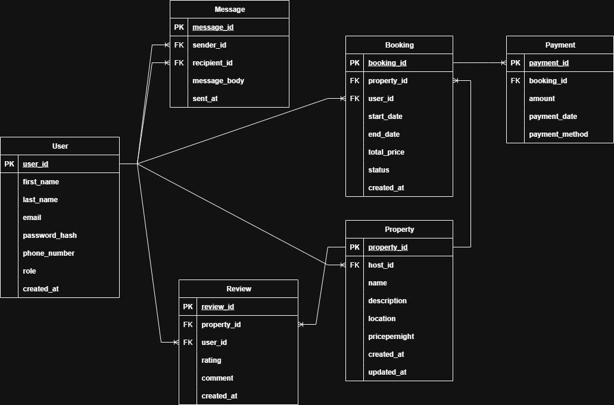

# Airbnb Database ER Diagram

## Overview

This document outlines the Entity-Relationship Diagram (ERD) for the Airbnb-like application database. It visualizes all entities, attributes, and relationships as defined in the project specification.

## ER Diagram

The ER diagram visually represents the structure of the database, showing the entities and how they relate to each other.

---

## Entities and Attributes

### **User**
- `user_id` (UUID, Primary Key, Indexed)
- `first_name` (VARCHAR, NOT NULL)
- `last_name` (VARCHAR, NOT NULL)
- `email` (VARCHAR, UNIQUE, NOT NULL)
- `password_hash` (VARCHAR, NOT NULL)
- `phone_number` (VARCHAR, NULL)
- `role` (ENUM: guest, host, admin, NOT NULL)
- `created_at` (TIMESTAMP, DEFAULT CURRENT_TIMESTAMP)

### **Property**
- `property_id` (UUID, Primary Key, Indexed)
- `host_id` (UUID, Foreign Key → User.user_id)
- `name` (VARCHAR, NOT NULL)
- `description` (TEXT, NOT NULL)
- `location` (VARCHAR, NOT NULL)
- `pricepernight` (DECIMAL, NOT NULL)
- `created_at` (TIMESTAMP, DEFAULT CURRENT_TIMESTAMP)
- `updated_at` (TIMESTAMP, ON UPDATE CURRENT_TIMESTAMP)

### **Booking**
- `booking_id` (UUID, Primary Key, Indexed)
- `property_id` (UUID, Foreign Key → Property.property_id)
- `user_id` (UUID, Foreign Key → User.user_id)
- `start_date` (DATE, NOT NULL)
- `end_date` (DATE, NOT NULL)
- `total_price` (DECIMAL, NOT NULL)
- `status` (ENUM: pending, confirmed, canceled, NOT NULL)
- `created_at` (TIMESTAMP, DEFAULT CURRENT_TIMESTAMP)

### **Payment**
- `payment_id` (UUID, Primary Key, Indexed)
- `booking_id` (UUID, Foreign Key → Booking.booking_id)
- `amount` (DECIMAL, NOT NULL)
- `payment_date` (TIMESTAMP, DEFAULT CURRENT_TIMESTAMP)
- `payment_method` (ENUM: credit_card, paypal, stripe, NOT NULL)

### **Review**
- `review_id` (UUID, Primary Key, Indexed)
- `property_id` (UUID, Foreign Key → Property.property_id)
- `user_id` (UUID, Foreign Key → User.user_id)
- `rating` (INTEGER, CHECK rating BETWEEN 1 AND 5, NOT NULL)
- `comment` (TEXT, NOT NULL)
- `created_at` (TIMESTAMP, DEFAULT CURRENT_TIMESTAMP)

### **Message**
- `message_id` (UUID, Primary Key, Indexed)
- `sender_id` (UUID, Foreign Key → User.user_id)
- `recipient_id` (UUID, Foreign Key → User.user_id)
- `message_body` (TEXT, NOT NULL)
- `sent_at` (TIMESTAMP, DEFAULT CURRENT_TIMESTAMP)

---

## Relationships

- A **User** can be a **guest**, **host**, or **admin** (role-based).
- A **User** (as host) can create multiple **Properties**.
- A **User** (as guest) can make multiple **Bookings**.
- A **Booking** must be linked to both a **User** and a **Property**.
- A **Booking** can have one associated **Payment**.
- A **Property** can have multiple **Reviews** from different **Users**.
- A **User** can write multiple **Reviews** for different **Properties**.
- A **User** can send and receive multiple **Messages** (self-referencing relationship).

---

## Design Notes

- **UUIDs** are used for all primary keys to ensure uniqueness across distributed systems.
- **ENUMs** are applied for role, status, and payment method to enforce valid values.
- **Foreign keys** ensure referential integrity between linked entities.
- **Timestamps** help track creation and update activity for records.
- Indexes are added to primary keys by default, with additional indexes on frequently queried fields like `email`, `property_id`, and `booking_id`.

---
